# YOLO26 inference-strategy research

Four standalone Python research scripts (no DeepStream, no Triton) comparing
inference strategies on a single dense traffic image. Each subdirectory is
self-contained — `compare.py`, `requirements.txt`, generated `output/`. This
top-level README ties all four together with images and metrics.

All runs use the same conditions:

| | |
|---|---|
| Test image | `apps/deepstream-yolo26x-sahi-triton/scripts/sahi_test.png` |
| Image size | 1280 × 720 |
| Confidence floor | `--conf 0.10` |
| Cross-tile merge | GREEDYNMM, IoS metric, threshold 0.5, class-aware |
| Inference | Ultralytics YOLO via `model.predict()` on CUDA |
| Hardware | NVIDIA GeForce RTX 5070 Ti |

The metric columns are:

- **n** = total detections passing `conf ≥ 0.10`
- **≥0.5** = detections at high-confidence (the most "decisive" reading)
- **≥0.25** = detections at moderate confidence
- **params / weight** = model parameters (millions) and `.pt` size on disk (MB)
- **latency** = wall-clock time for inference on this single image (post-warmup)

---

## Test image


A daytime highway scene with vehicles at three rough depth bands:
- **Foreground** (bottom half): cars and trucks at clear pixel scale (50–200 px tall)
- **Mid-range** (around the median): vehicles at 20–50 px
- **Distant** (upper highway curve, top-left): vehicles at 5–15 px

The research question, repeatedly: which inference strategy actually finds
the distant ones?

---

## Research #1 — strategies × yolo26x

Four inference strategies on the same model (`yolo26x.pt`). Asks: does
tiling beat just running at higher resolution? Includes a `sahi`-package
cross-check on strategy 4 to validate the hand-rolled GREEDYNMM merge.

| # | Strategy            | n   | ≥0.5 | ≥0.25 | latency |
|---|---------------------|-----|------|-------|---------|
| 1 | default 640         | 36  | 5    | 16    | 8 ms    |
| 2 | upscale 1280        | 85  | 19   | 41    | 22 ms   |
| 3 | SAHI 640 (no zoom)  | 84  | 21   | 42    | 70 ms   |
| 4 | **SAHI 320 (2× zoom)** | **135** | **64** | **95** | 174 ms |
| ✓ | sahi-pkg cross-check | 135 | 64   | 96    | 550 ms  |

### 2×2 overview

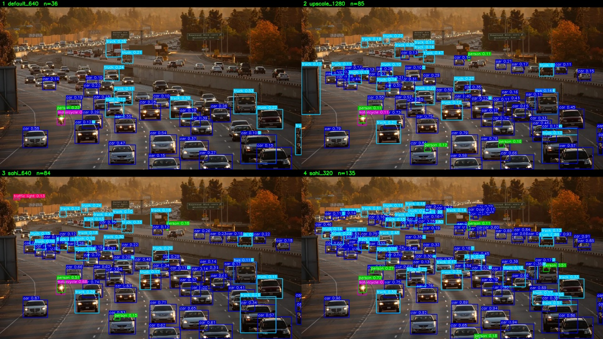

### Individual outputs

**1 — default 640: n=36, ≥0.5=5, latency=8 ms**
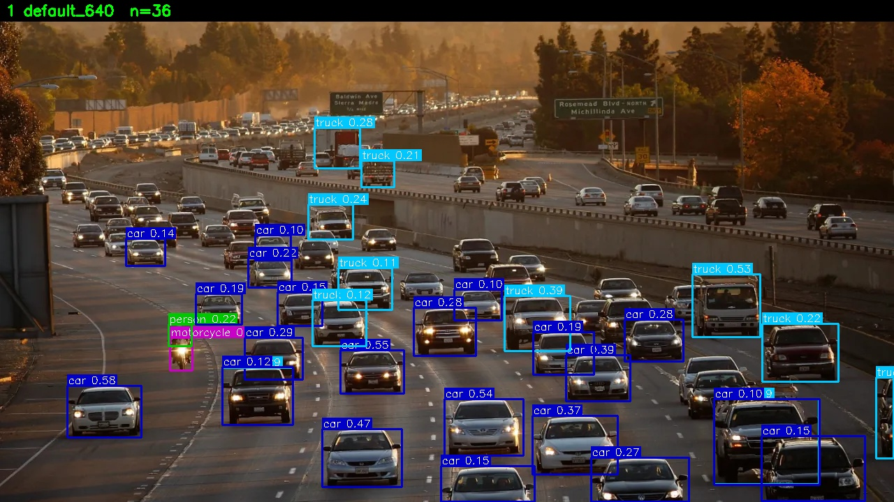

**2 — upscale 1280: n=85, ≥0.5=19, latency=22 ms**
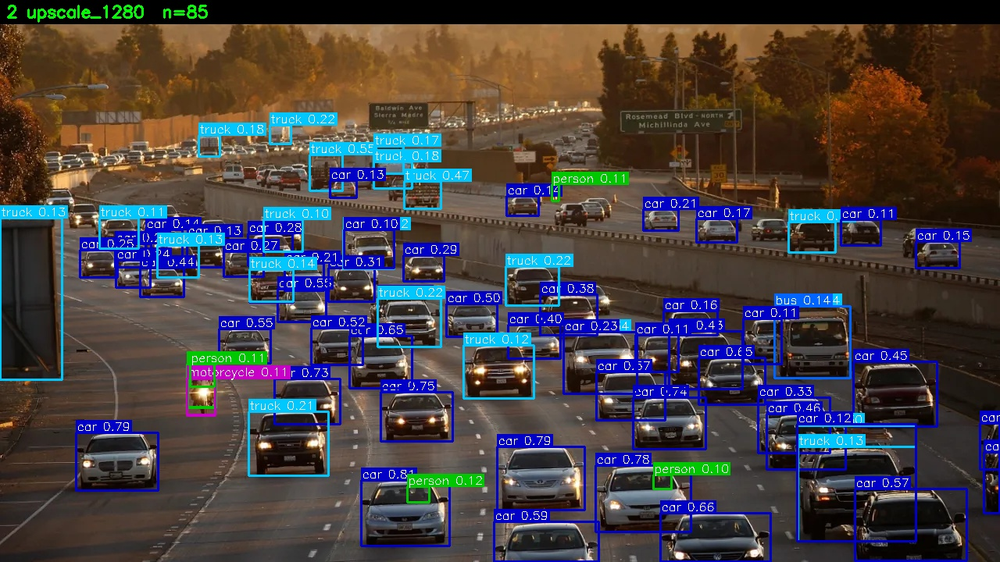

**3 — SAHI 640 (production geometry): n=84, ≥0.5=21, latency=70 ms**
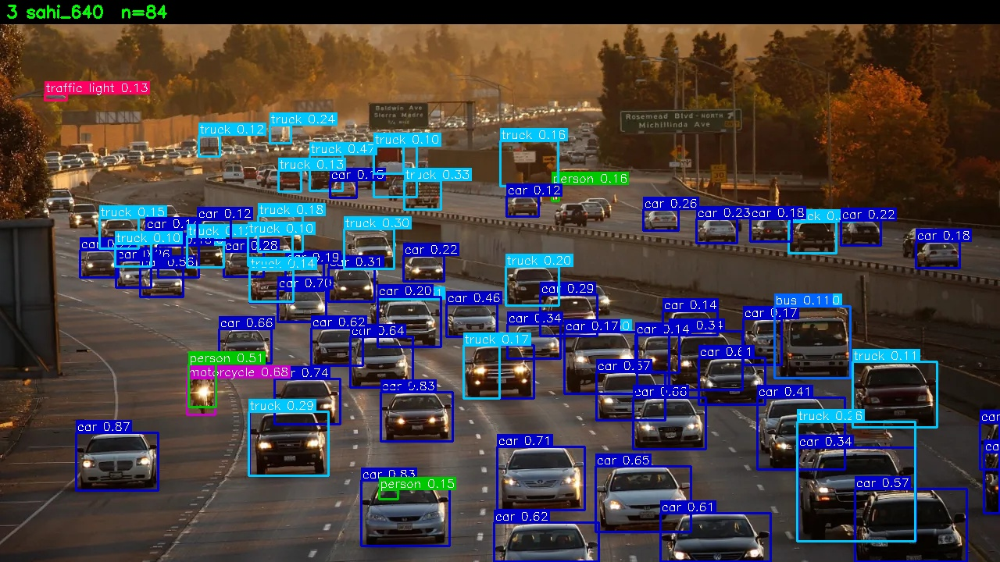

**4 — SAHI 320 (2× zoom, 15 tiles): n=135, ≥0.5=64, latency=174 ms**
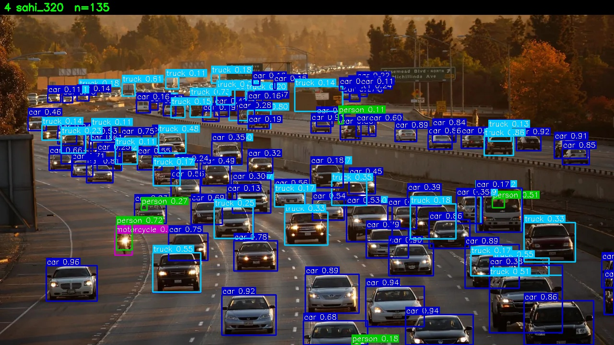

**Cross-check — `sahi` PyPI package: n=135, ≥0.5=64, latency=550 ms**
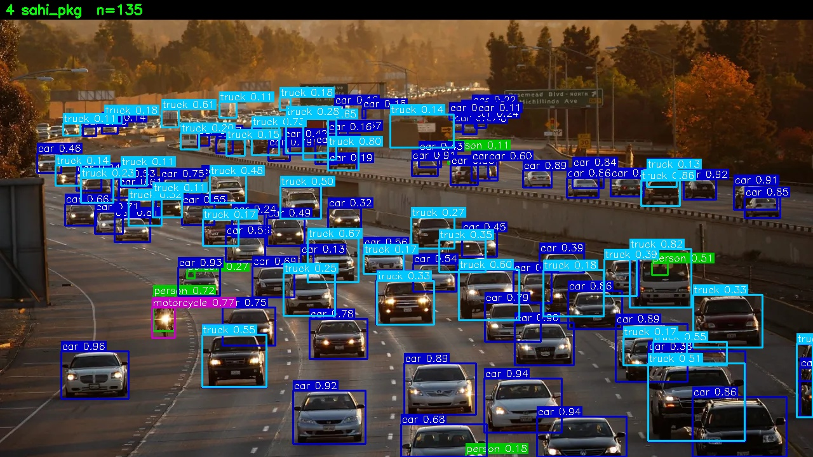

**Conclusion #1.** Real SAHI (small tiles upsampled, 2× zoom) finds 50%
more objects and 3× more high-confidence ones than either single-shot
strategy. Production "SAHI 640" gives essentially zero benefit over
`upscale_1280` because tile size = model input size = no zoom. Hand-rolled
GREEDYNMM matches the `sahi` package within tie-breaking noise (135 vs 135,
≥0.25 differs by 1).

---

## Research #2 — model sizes × resolutions

`yolo26{x,l,m,s,n}` at `imgsz=1280`, plus `yolo26x` at the production default
`imgsz=640` for reference. No tiling. Asks: when you go to higher resolution,
do you still need the biggest model?

| # | Model    | imgsz | n   | ≥0.5 | ≥0.25 | params | weight  | latency |
|---|----------|-------|-----|------|-------|--------|---------|---------|
| 1 | yolo26x  | 640   | 36  | 5    | 16    | 59 M   | 113 MB  | 8 ms    |
| 2 | yolo26x  | 1280  | 85  | 19   | 41    | 59 M   | 113 MB  | 22 ms   |
| 3 | yolo26l  | 1280  | 78  | 24   | 47    | 26 M   | 51 MB   | 12 ms   |
| 4 | yolo26m  | 1280  | 74  | 15   | 38    | 22 M   | 42 MB   | 10 ms   |
| 5 | **yolo26s** | 1280 | **87** | 25 | **56** | 10 M | 19 MB | 5 ms |
| 6 | yolo26n  | 1280  | 83  | **28** | 54  | **2.6 M** | **5.3 MB** | **4 ms** |

### 3×2 overview

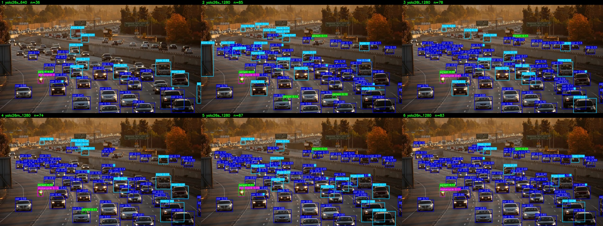

### Individual outputs

**1 — yolo26x @ 640 (production default): n=36, ≥0.5=5, params=59 M, latency=8 ms**


**2 — yolo26x @ 1280: n=85, ≥0.5=19, params=59 M, latency=22 ms**


**3 — yolo26l @ 1280: n=78, ≥0.5=24, params=26 M, latency=12 ms**
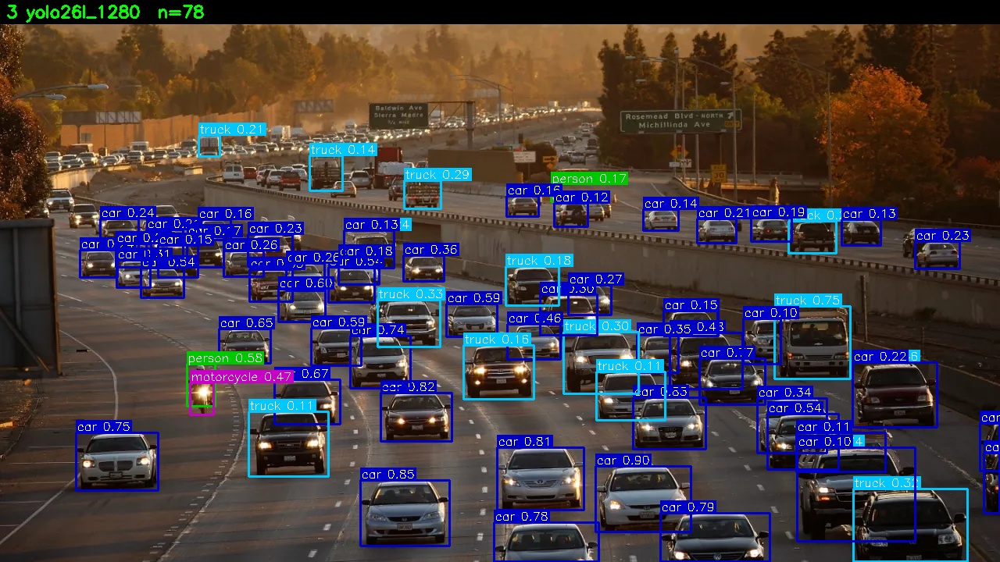

**4 — yolo26m @ 1280: n=74, ≥0.5=15, params=22 M, latency=10 ms**
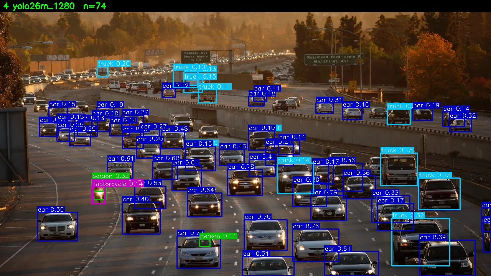

**5 — yolo26s @ 1280: n=87, ≥0.5=25, params=10 M, latency=5 ms**
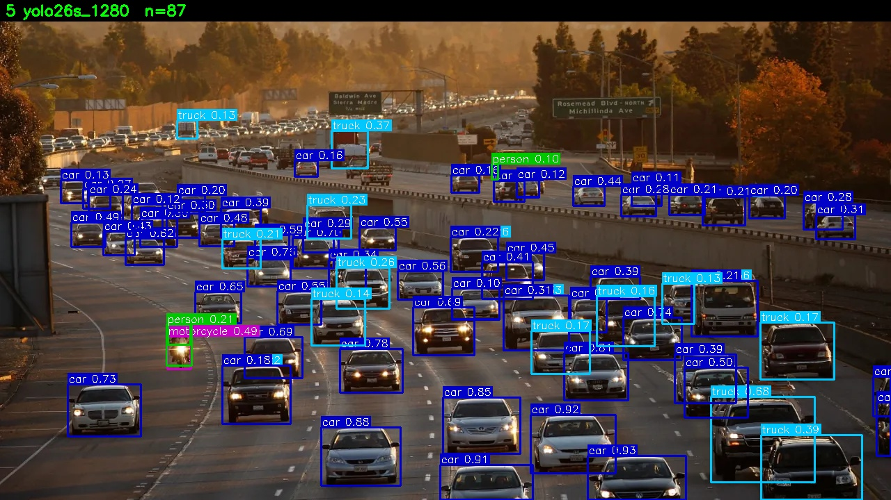

**6 — yolo26n @ 1280: n=83, ≥0.5=28, params=2.6 M, latency=4 ms**
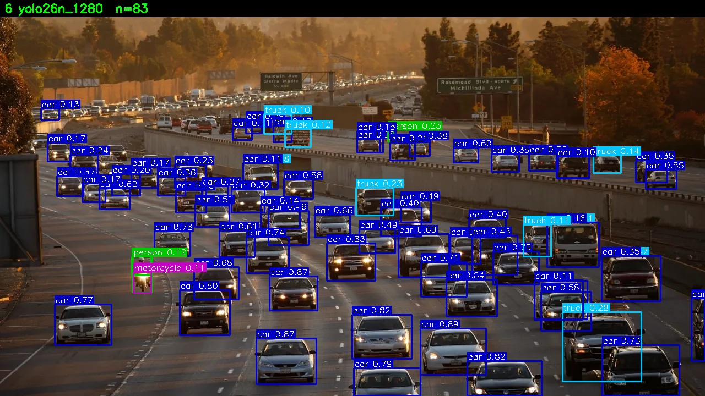

**Conclusion #2.** At `imgsz=1280`, the smaller models are **strictly better**
than yolo26x by every metric — `yolo26s` finds more total detections, more
high-confidence ones, and runs 4–5× faster. `yolo26n` (2.6 M params, 5.3 MB)
matches yolo26x's high-confidence count while being **22× lighter and 5.5× faster**.

---

## Research #3 — model sizes × SAHI 640 (production geometry)

All five sizes running the **production DeepStream/Triton SAHI geometry**:
6 tiles of 640 × 640 in source space → 640 × 640 model input. Effective zoom: 1×.
Asks: if we keep production tile geometry but swap models, do we still gain?

| # | Model           | n   | ≥0.5 | ≥0.25 | params  | weight  | latency |
|---|-----------------|-----|------|-------|---------|---------|---------|
| 1 | yolo26x sahi640 | 84  | 21   | 42    | 59 M    | 113 MB  | 70 ms   |
| 2 | yolo26l sahi640 | 83  | 29   | 52    | 26 M    | 51 MB   | 40 ms   |
| 3 | yolo26m sahi640 | 72  | 20   | 44    | 22 M    | 42 MB   | 32 ms   |
| 4 | **yolo26s sahi640** | **92** | **30** | **62** | 10 M | 19 MB | 24 ms |
| 5 | yolo26n sahi640 | 76  | 29   | 54    | **2.6 M** | **5.3 MB** | **22 ms** |

### 3×2 overview

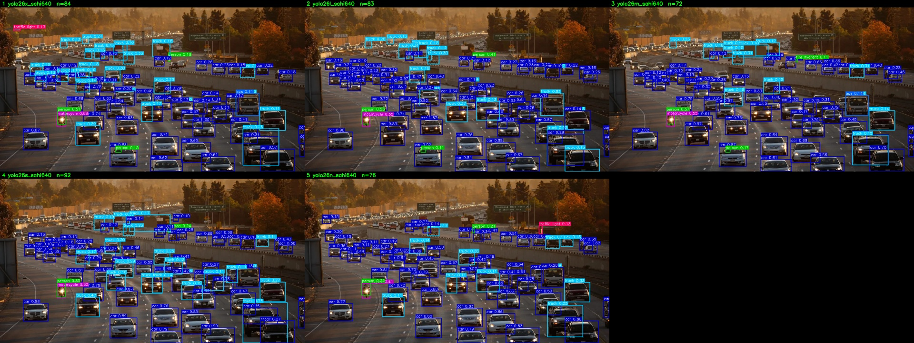

### Individual outputs

**1 — yolo26x SAHI 640: n=84, ≥0.5=21, latency=70 ms**


**2 — yolo26l SAHI 640: n=83, ≥0.5=29, latency=40 ms**
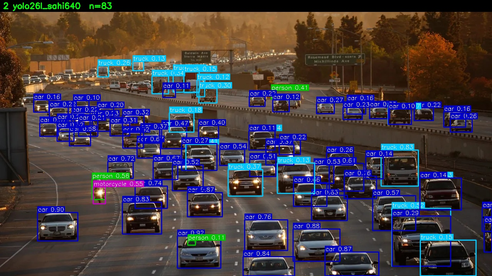

**3 — yolo26m SAHI 640: n=72, ≥0.5=20, latency=32 ms**
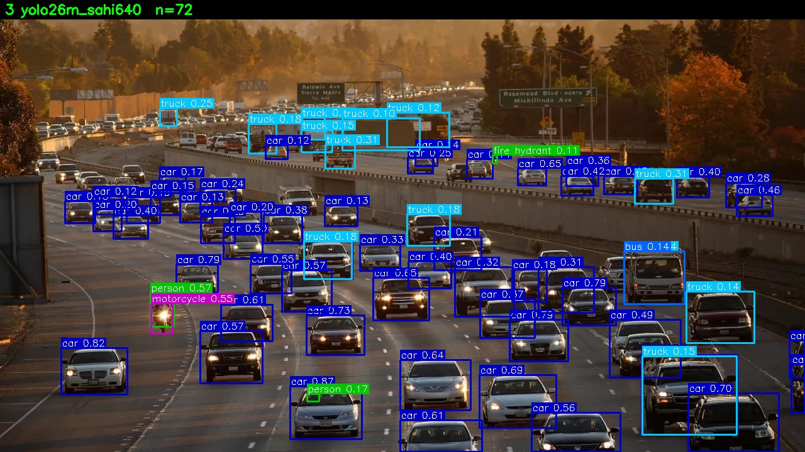

**4 — yolo26s SAHI 640: n=92, ≥0.5=30, latency=24 ms**
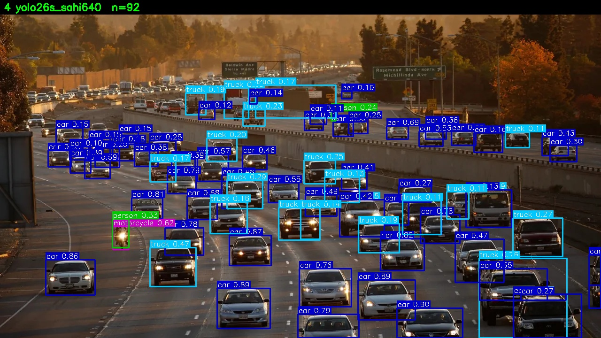

**5 — yolo26n SAHI 640: n=76, ≥0.5=29, latency=22 ms**
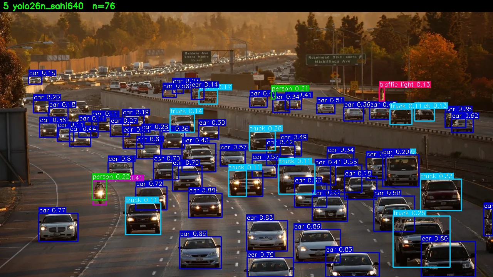

**Conclusion #3.** `yolo26s` wins again — same model that won in research #2.
Production tile geometry (640 → 640, no zoom) gives roughly the same
detection counts as `full @ 1280` for any given model, but at 3–5× the
latency. **Production SAHI is paying tile-overhead cost without buying a zoom benefit.**

---

## Research #4 — model sizes × SAHI 320 (real 2× zoom)

All five sizes running **real SAHI**: 15 tiles of 320 × 320 in source space →
640 × 640 model input. Effective zoom: 2×. This is what SAHI papers actually
do. Asks: does small-tile zoom continue helping after we swap to a smaller model?

| # | Model           | n   | ≥0.5 | ≥0.25 | params | weight  | latency |
|---|-----------------|-----|------|-------|--------|---------|---------|
| 1 | yolo26x sahi320 | **135** | 64 | 95 | 59 M  | 113 MB  | 174 ms  |
| 2 | yolo26l sahi320 | 121 | 65   | 93    | 26 M   | 51 MB   | 102 ms  |
| 3 | yolo26m sahi320 | 117 | 59   | 89    | 22 M   | 42 MB   | 81 ms   |
| 4 | **yolo26s sahi320** | 133 | **77** | **104** | 10 M | 19 MB | **61 ms** |
| 5 | yolo26n sahi320 | 129 | 68   | 90    | **2.6 M** | **5.3 MB** | 58 ms |

### 3×2 overview

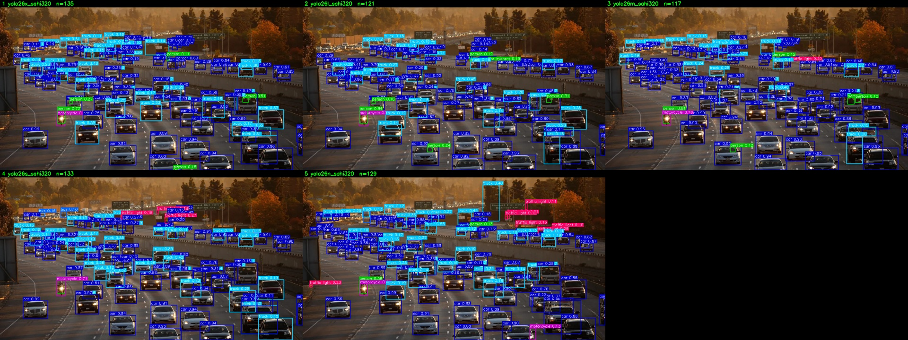

### Individual outputs

**1 — yolo26x SAHI 320: n=135, ≥0.5=64, latency=174 ms**
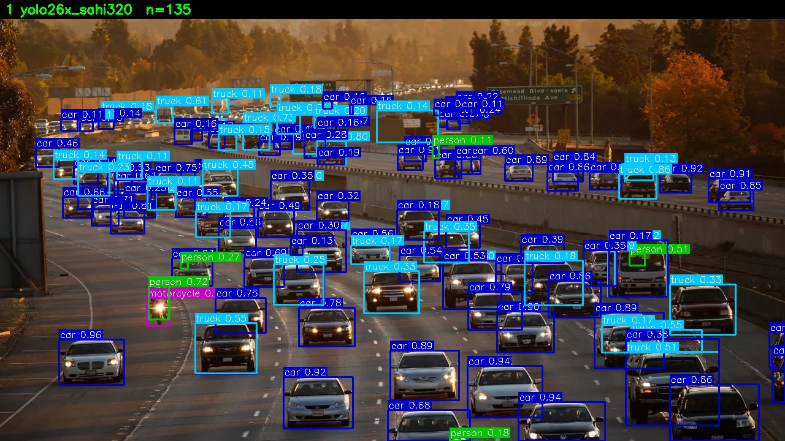

**2 — yolo26l SAHI 320: n=121, ≥0.5=65, latency=102 ms**
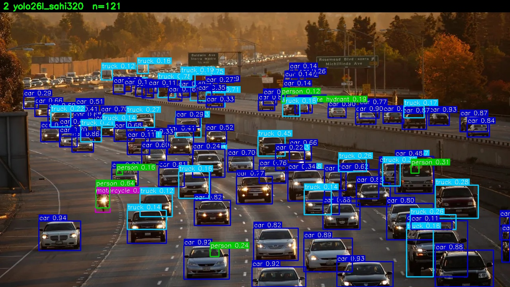

**3 — yolo26m SAHI 320: n=117, ≥0.5=59, latency=81 ms**
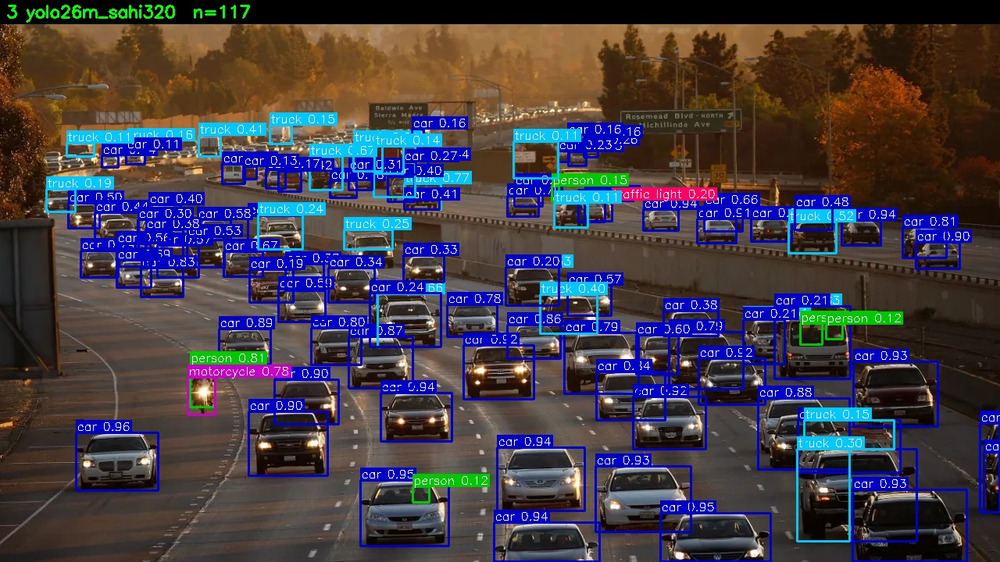

**4 — yolo26s SAHI 320: n=133, ≥0.5=77, latency=61 ms**
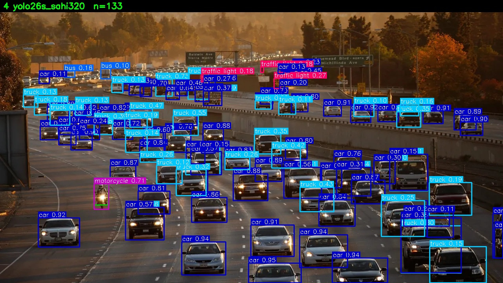

**5 — yolo26n SAHI 320: n=129, ≥0.5=68, latency=58 ms**
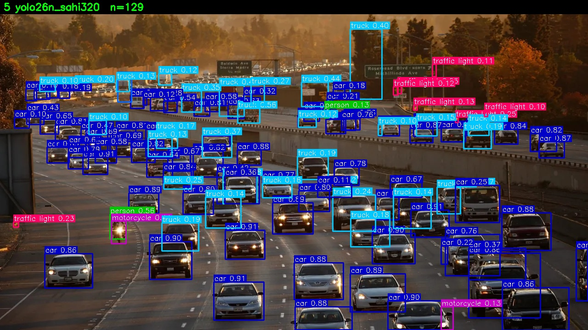

**Conclusion #4.** Real SAHI + small model is the best of every metric.
`yolo26s sahi320` finds the most high-confidence detections (77 — beating
even `yolo26x sahi320`'s 64 by 20%), at 61 ms, with a 19 MB weight file.
The small-tile zoom advantage stacks with the small-model advantage.

---

## Grand leaderboard

All 16 unique runs sorted by **≥0.5** descending. The four research scripts
collectively explored a model × strategy matrix; this is what the data looks
like flattened.

| Rank | Model    | Strategy           | n   | ≥0.5 | ≥0.25 | params | weight  | latency |
|---:|---|---|---:|---:|---:|---:|---:|---:|
| 🥇 1 | **yolo26s** | **SAHI 320** | 133 | **77** | **104** | 10 M | 19 MB | 61 ms |
| 🥈 2 | yolo26n | SAHI 320           | 129 | 68   | 90    | 2.6 M  | 5.3 MB  | 58 ms   |
| 🥉 3 | yolo26l | SAHI 320           | 121 | 65   | 93    | 26 M   | 51 MB   | 102 ms  |
| 4    | yolo26x | SAHI 320           | **135** | 64 | 95 | 59 M  | 113 MB  | 174 ms  |
| 5    | yolo26m | SAHI 320           | 117 | 59   | 89    | 22 M   | 42 MB   | 81 ms   |
| 6    | yolo26s | SAHI 640           | 92  | 30   | 62    | 10 M   | 19 MB   | 24 ms   |
| 7    | yolo26l | SAHI 640           | 83  | 29   | 52    | 26 M   | 51 MB   | 40 ms   |
| 7    | yolo26n | SAHI 640           | 76  | 29   | 54    | 2.6 M  | 5.3 MB  | 22 ms   |
| 9    | yolo26n | full @ 1280        | 83  | 28   | 54    | **2.6 M** | **5.3 MB** | **4 ms** |
| 10   | yolo26s | full @ 1280        | 87  | 25   | 56    | 10 M   | 19 MB   | **5 ms** |
| 11   | yolo26l | full @ 1280        | 78  | 24   | 47    | 26 M   | 51 MB   | 12 ms   |
| 12   | yolo26x | SAHI 640           | 84  | 21   | 42    | 59 M   | 113 MB  | 70 ms   |
| 13   | yolo26m | SAHI 640           | 72  | 20   | 44    | 22 M   | 42 MB   | 32 ms   |
| 14   | yolo26x | full @ 1280        | 85  | 19   | 41    | 59 M   | 113 MB  | 22 ms   |
| 15   | yolo26m | full @ 1280        | 74  | 15   | 38    | 22 M   | 42 MB   | 10 ms   |
| 16   | yolo26x | full @ 640 (production) | 36 | 5 | 16  | 59 M   | 113 MB  | 8 ms    |

Top 5 are all SAHI 320. The current production default sits dead last.

---

## Recommendation

Two changes to the production DeepStream/Triton SAHI ensemble would put it
on the top of this table:

| What     | Current      | Recommended           |
|----------|--------------|-----------------------|
| Model    | `yolo26x`    | `yolo26s` (or `yolo26n` for embedded) |
| Tile geometry | 6 × 640²  in source | **15 × 320² in source → 640² model input (2× zoom)** |

The work to port:
1. Rebuild `sahi_preprocess.plan` with `Slice + Resize` ops for 15 tiles of
   320×320 → 640×640. The current plan is `Slice + Concat` only (the
   `Resize` is the new piece).
2. Build a `yolo26s_b15` Triton model from the smaller `.pt` (one-time
   `trtexec --onnx=… --saveEngine=… --minShapes=…1×3×640×640
   --optShapes=…15×3×640×640 --maxShapes=…15×3×640×640 --fp16`).
3. Update `sahi_postprocess/1/model.py` with the new tile offset table and
   `(scale_x, scale_y) = (0.5, 0.5)` to map 640-input boxes back to
   320-source coords before adding offsets.
4. Update the ensemble `config.pbtxt` with the new model names and the new
   `tile_dets` shape (`[15, 300, 6]` instead of `[6, 300, 6]`).

Net effect on production:
- Latency: ~70 ms → ~61 ms (faster, despite 15 tiles vs 6)
- Detections: ~84 → 133 total, 21 → **77 high-confidence**
- Model size: 113 MB → 19 MB (6× smaller GPU memory footprint)

---

## Reproducing

Inside the DeepStream container, GPU available, ~500 MB disk for model
auto-downloads on first run:

```bash
cd /workspace/research/yolo26x_sahi_compare
pip install -r requirements.txt
python3 compare.py --image /apps/deepstream-yolo26x-sahi-triton/scripts/sahi_test.png --conf 0.10

cd ../yolo26_size_compare      && pip install -r requirements.txt && python3 compare.py --image /apps/deepstream-yolo26x-sahi-triton/scripts/sahi_test.png --conf 0.10
cd ../yolo26_sahi640_size      && pip install -r requirements.txt && python3 compare.py --image /apps/deepstream-yolo26x-sahi-triton/scripts/sahi_test.png --conf 0.10
cd ../yolo26_sahi320_size      && pip install -r requirements.txt && python3 compare.py --image /apps/deepstream-yolo26x-sahi-triton/scripts/sahi_test.png --conf 0.10
```

Each subdirectory has its own `README.md` explaining that specific research
in more detail.
